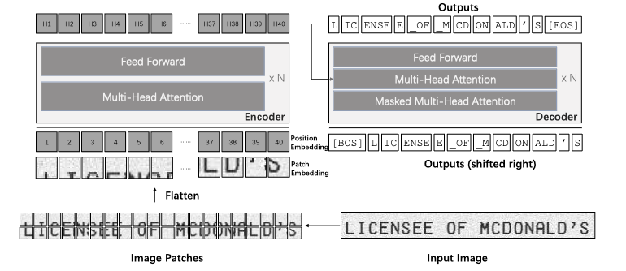

# 📜 Historical Spanish Text Recognition using TrOCR

## 📌 Problem Statement

Build a high-accuracy model for recognizing and transcribing historical Spanish text using modern deep learning methods, including OCR-specific and self-supervised approaches.

---

## 📂 Dataset Description

This competition provides both training and test datasets containing images of historical Spanish handwritten text for transcription. Participants are required to build models that can predict transcriptions from unseen test images.

### 🗃️ Files Provided

- **`train.csv`**  
  - `unique Id`: Identifier for each training image.  
  - `transcription`: Ground truth text associated with the image.

- **`test.csv`**  
  - `unique Id`: Follows the format `P_{i}_L_{j}`, where:  
    - `i`: Page number (1–4)  
    - `j`: Line number within the page (1–24)

- **`submission.csv`**  
  - A sample submission file for model predictions.
 
## 📌 My Approach 

## 🖼️ Image Preprocessing

Before feeding historical documents into the OCR model, we performed a series of **image preprocessing steps** designed to enhance text visibility, reduce noise, and improve the model's ability to learn meaningful patterns from the input data. These steps are critical when working with historical texts, which often contain faded characters, noise, and inconsistent lighting.

### 🔧 Image Processing Pipeline:

1. **Grayscale Conversion**  
   Converted the RGB images to grayscale, reducing the data to a single channel. This simplifies computations and removes irrelevant color information, focusing only on the text and background contrast.

2. **Sharpening**  
   Applied a gentle sharpening filter using a custom kernel to enhance edges. This makes the outlines of the characters crisper and helps the model distinguish between text and background more effectively.

3. **Denoising (Median Filtering)**  
   Used a **median filter of size 3** to remove salt-and-pepper noise and small speckles commonly found in old documents. This step preserves important edges while smoothing out irrelevant noise.

4. **Binarization**  
   Applied a basic **adaptive thresholding** (threshold fixed at 150) to convert grayscale images into pure black and white. This binarization enhances the contrast between characters and background, making it easier for the OCR model to focus on text.

> These preprocessing steps significantly improved OCR accuracy by providing cleaner, more structured input to the model.

---

## 🧠 OCR Model Fine-Tuning (TrOCR)

The second part of the project involved fine-tuning **TrOCR**, a state-of-the-art OCR model from Microsoft, specifically for Spanish text transcription.

### 🔍 Model Overview

We used the `trocr-large-spanish` variant, which is a combination of a **Vision Transformer (ViT) encoder** and a **GPT2-style decoder**:

- **Encoder (ViT):**  
  Breaks the input image into patches and transforms them into visual embeddings representing features across the image.
  
- **Decoder (Autoregressive Transformer):**  
  Takes the visual features and generates the output text in an **autoregressive** manner—predicting one wordpiece at a time while considering previous tokens and visual context.

This architecture allows for highly accurate and robust OCR, even in zero-shot settings.

### ⚙️ Training Setup

- **Model:** [`trocr-large-spanish`]([https://huggingface.co/microsoft/trocr-large-spanish](https://huggingface.co/qantev/trocr-large-spanish))
- **Training Samples:** 2,000,000 image-text Spanish pairs
- **Approach:** Fine-tuned on our custom preprocessed dataset
- **Capability:** **Zero-shot text classification**, enabling generalization to new and unseen styles or classes of text

> Zero-shot classification allows the model to recognize and transcribe previously unseen character sets or layouts without retraining on them.

---

## 📈 Outcome

- Achieved high transcription accuracy on various historical Spanish documents.
- The image preprocessing pipeline was crucial in improving OCR performance.
- TrOCR's vision-language architecture proved effective for complex OCR scenarios involving degraded or stylized text.

---

## 📏 Evaluation Metric

Model performance is evaluated using:

### 🔡 Word Error Rate (WER)

WER quantifies how many words were incorrectly predicted compared to the ground truth. It is calculated as:

\[
\{WER} = {S + D + I}/{N}
\]

- `S`: Substitutions  
- `D`: Deletions  
- `I`: Insertions  
- `N`: Total words in the reference text

### 🔠 Character Error Rate (CER)

Similar to WER, but calculated at the character level—offering a finer granularity for evaluating OCR performance, especially in closely matched predictions.

---

### 📊 Final Results

| Model                      | WER     | CER     |
|---------------------------|---------|---------|
| `trocr-large-spanish`     | 0.1817  | 0.0632  |

> Note: Our model was evaluated on a **hidden test dataset**, making the WER of 0.299 a robust measure of real-world performance.

---

## 👤 Author

**Shashwat Mandal**  
📍 IIT(ISM) Dhanbad  

